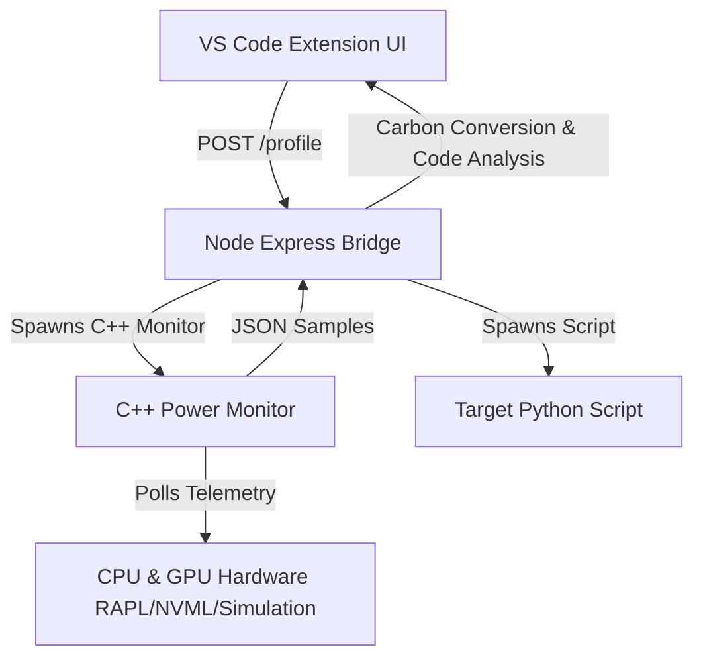

# GreenOps Profiler — Nemesis Hackathon Prototype

GreenOps Profiler measures energy consumption (Joules) and estimated carbon footprint (gCO2eq) of scripts, highlighting inefficient code paths directly in VS Code.

## Team: Nemesis
- **Sruthi Gunaseelan**: UI/UX Developer (VS Code Extension).
- **Ragavendra M**: Systems Bridge & API Architect (Node.js/Express).
- **Venkataraam VG**: Power Monitor Engineer (C++ & HW Telemetry).

---

## 1. System Architecture/Workflow



### 1.1 Mode Status: SIMULATED
The project currently executes under **Simulation Mode**. Since the host machine is Windows, native Linux powercap sysfs registries (`/sys/class/powercap/intel-rapl`) and nvidia-smi GPU wrappers are unavailable. The monitor falls back to estimating CPU power usage based on process CPU usage percentages. Running on real hardware requires deployment to a native Linux target with RAPL/NVML libraries configured.

### 1.2 Sampling Rate vs Overhead
RAPL counters update every ~1ms. Our monitor polls at a configurable 100ms interval to optimize telemetry accuracy while keeping execution overhead under 1%.

### 1.3 Sub-sampling-resolution limits
Scripts that complete faster than the sampling interval (such as sub-millisecond execution times) report an estimated floor value of `0.05 Joules` along with the flag `"measurement_note": "below sampling resolution, value is a floor estimate"`.

---

## 2. Quick Start

### 2.1 C++ Power Monitor Build
```bash
cd monitor
cmake -G "MinGW Makefiles" .
cmake --build .
```

### 2.2 Express Bridge Startup
```bash
cd ../bridge
npm install
node server.js
```

### 2.3 VS Code Extension Build
```bash
cd ../extension
npm install
npm run compile
```

---

## 3. Scale the Impact (Pitch Extrapolation)

> [!NOTE]
> If a recursive Fibonacci calculation runs 10,000 times a day in production, it consumes ~26,204 Joules.
> By optimization to the iterative pattern (0.05 Joules/run), daily consumption drops to 500 Joules.
> This represents a **98.1% carbon reduction**, equivalent to preventing the emissions of ~2.71g CO2eq daily per server node.
