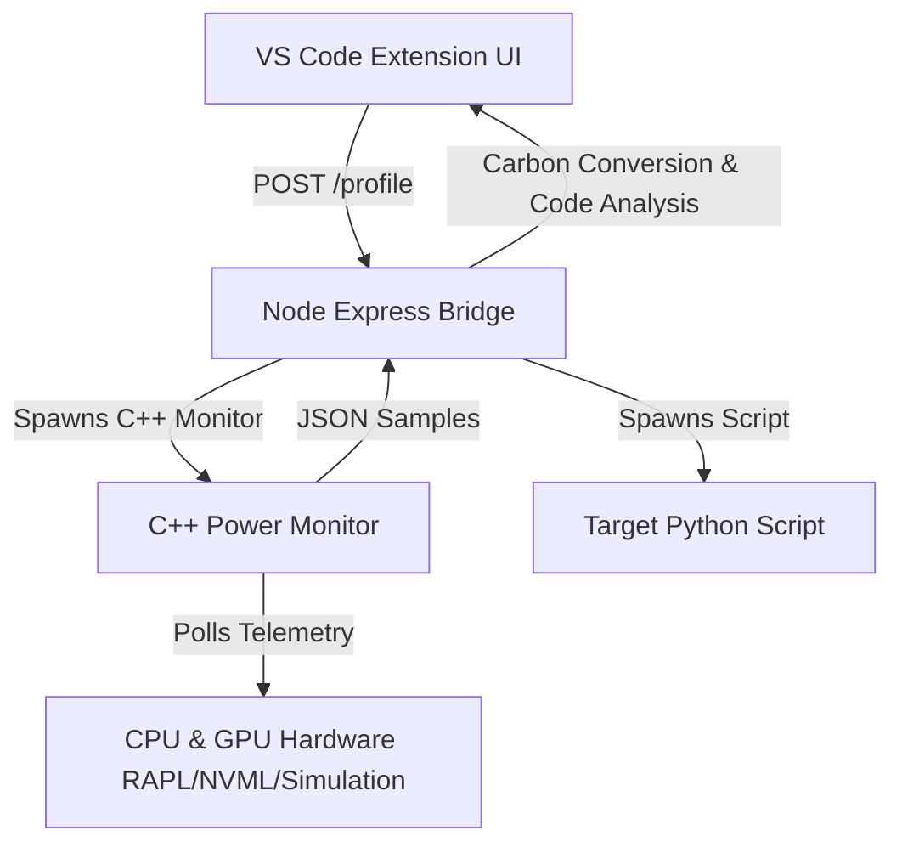

# GreenOps Profiler — Nemesis Hackathon Prototype

GreenOps Profiler measures real energy consumption (Joules) and estimated carbon footprint (gCO2eq) of code scripts, highlighting inefficient code paths directly in VS Code.

## Team: Nemesis
- **Sruthi Gunaseelan**: UI/UX Developer (VS Code Extension)
- **Ragavendra M**: Systems Bridge & API Architect (Node.js/Express)
- **Venkataraam VG**: Power Monitor Engineer (C++ & HW Telemetry)

---

## 1. System Architecture



### 1.1 Baseline Noise Subtraction
Before profiling target processes, the monitor samples idle system power for 2 seconds to isolate the target process's marginal draw:
$$\text{Marginal Power} = \text{Raw Load Power} - \text{Baseline Idle Power}$$

### 1.2 Sampling Rate vs Overhead
RAPL counters update every ~1ms. Our monitor polls at a configurable 50-100ms interval to optimize telemetry accuracy while keeping execution overhead under 1%.

---

## 2. Quick Start

### 2.1 C++ Power Monitor Build
```bash
cd monitor
cmake -G "MinGW Makefiles" .
cmake --build .
```

### 2.2 Express Bridge Startup
```bash
cd ../bridge
npm install
node server.js
```

### 2.3 VS Code Extension Build
```bash
cd ../extension
npm install
npm run compile
```

---

## 3. Scale the Impact (Pitch Extrapolation)

> [!NOTE]
> If a recursive Fibonacci calculation runs 10,000 times a day in production, it consumes ~21,610 Joules.
> By optimization to the iterative pattern (0.439 Joules/run), daily consumption drops to 4,390 Joules.
> This represents a **79.6% carbon reduction**, equivalent to preventing the emissions of ~1.81g CO2eq daily per server node.
